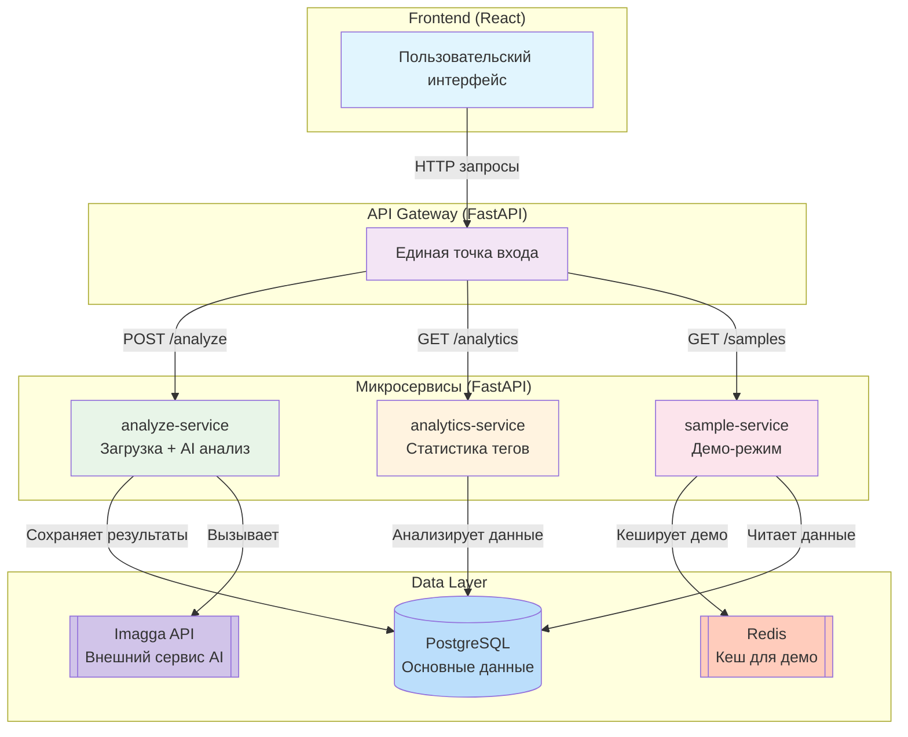

# Тарасов Кирилл | Python Backend Developer | 17 лет

*Создаю работающие приложения из идей. Полный цикл: от архитектуры до продукта, работающего на VPS*

```python
# Мой подход к разработке:
def build_project(idea: Concept) -> DeployedSystem:
    """
    От проектирования до production-деплоя.
    """
    architecture = design_architecture()  # SOLID, Clean Code, Микросервисы, IaC
    backend = implement_backend()         # Python, Django/FastAPI, PostgreSQL
    tests = optimize_and_test()           # Pytest, CI/CD, 85%+ coverage
    containers = containerize()           # Docker, Docker Compose
    production = deploy_to_production()   # VPS, Gunicorn, Nginx, SSL
    
    return system_live_on_server()        # nightcoder.rdeaps.com | imagetaganalyzer.rdeaps.com

```

**Основной стек:** `Python` `Django` `FastAPI` `PostgreSQL` `Docker` `K8s` `Nginx` `Gunicorn` `VPS`

[](https://t.me/bravekirty)
[](tel:+79096552008)  
[](mailto:bravekirty@gmail.com)
[](https://github.com/bravekirty)


## 🐱 Мои пет-проекты

<div align="center">

| 🧩 | Проект | Демо | Код | Технологии | Что внутри |
|-|--------|------|-----|------------|------------|
| 🌙 | [Форум **Night Coder**](https://nightcoder.rdeaps.com) | [👉 Демо](https://nightcoder.rdeaps.com) |  [GitHub](https://github.com/bravekirty/NightCoder) | `Django` `PostgreSQL` `Docker` `CI/CD` | **[SOLID](https://github.com/bravekirty/NightCoder/blob/main/django_forum/core/SOLID.md)**, тесты 85%+, модули |
| 🖼️ | [**Image Tag Analyzer**](https://imagetaganalyzer.rdeaps.com) |  [👉 Демо](https://imagetaganalyzer.rdeaps.com) |  [GitHub](https://github.com/bravekirty/ImageTagAnalyzer) | `FastAPI` `K8s` `React` `Redis` | **[Микросервисы](https://github.com/bravekirty/ImageTagAnalyzer/blob/main/Microservices_Diagram.md)**, async, AI анализ |

</div>

---

## 🌙 Night Coder Django форум


**🔗 [Демо](https://nightcoder.rdeaps.com) | [Код](https://github.com/bravekirty/NightCoder) | [SOLID реализация](https://github.com/bravekirty/NightCoder/blob/main/django_forum/core/SOLID.md)**

> Полнофункциональная платформа для сообщества разработчиков с системой репутации.

### 🎯 Ключевые компетенции:

| Область | Что реализовано | Почему это важно |
|---------|----------------|------------------|
| **Архитектура** | [Все 5 принципов SOLID](https://github.com/bravekirty/NightCoder/blob/main/django_forum/core/SOLID.md) в системе голосования | Умение проектировать масштабируемые системы |
| **Production** | Развернуто на моём VPS (Nginx, Gunicorn, SSL) | Полный контроль над инфраструктурой |
| **Качество кода** | 85%+ тестов, CI/CD, чистая история коммитов | Профессиональный подход к разработке |
| **Завершённые модули** | Аутентификация, Форум, Отзывы, Лидерборды | Способность доводить до production |

### 🏗️ **Технические особенности:**

```yaml
Архитектура:
  - Монолит с чистыми слоями
  - Система голосования: Repository + Service pattern
  - Модульная структура: разделение на apps (forum, reviews, users, votes)

База данных:
  - PostgreSQL 17 с оптимизированными индексами
  - Оптимизированные запросы через ORM

DevOps:
  - Docker + Docker Compose
  - CI: тесты и линтинг
  - VPS: Gunicorn, Nginx, SSL

Фронтенд:
  - Bootstrap 5 + кастомный CSS
  - Темная тема, адаптивный дизайн
  - JavaScript для интерактива
  - Поддержка русского и английского языка
```

### 📈 **Цифры и факты:**

- ✅ **85%+ покрытие тестами** ключевой бизнес-логики
- ✅ **80+ коммитов** с осмысленными сообщениями
- ✅ **5+ месяцев** работы без критических багов в production
- ✅ **Полный production стек:** Django + PostgreSQL + Docker + Gunicorn + Nginx
- ✅ **SOLID-архитектура** с документацией и примерами
- ✅ **CI/CD пайплайн:** тесты + линтинг при каждом коммите

### 📚 **Что я вынес из проекта:**

1. **SOLID это как детальки LEGO:**
    - Каждая "деталька" (класс) делает одну вещь.
    - Все детальки соединяются стандартным образом.
    - Можно собрать что угодно из одних и тех же деталек.
    - Гораздо проще поддерживать, тестировать и добавлять новый функционал.
2. **Разобрался в production:** настроить проект на VPS проще, чем кажется.
3. **Довести до конца > сделать много:** 5 завершённых модулей ценнее 10 незаконченных.
4. **Современные инструменты:** DeepSeek помогает с рутиной (тесты, фронтенд), освобождая время для архитектурных решений.


---

## 🖼️ Image Tag Analyzer


**🔗 [Демо](https://imagetaganalyzer.rdeaps.com) | [Код](https://github.com/bravekirty/ImageTagAnalyzer) | [Схема микросервисной архитектуры](https://github.com/bravekirty/ImageTagAnalyzer/blob/main/Microservices_Diagram.md)**

> **Эксперимент с микросервисной архитектурой** на реальном примере анализа изображений. 
> Цель не создать high-load систему, а **понять на практике** принципы распределенных систем.

### 🎯 Ключевые компетенции:

| Область | Что реализовано | Почему это важно |
|---------|----------------|------------------|
| **Архитектура** | Микросервисы (API Gateway + 3 сервиса), shared models | Умение проектировать распределённые системы с чёткими контрактами |
| **Оркестрация** | [Развёртывание в Kubernetes (Minikube)](https://github.com/bravekirty/ImageTagAnalyzer/tree/main/k8s) | Опыт работы с промышленными инструментами контейнеризации, умение описывать инфраструктуру как код (IaC) |
| **Async & Cache** | Асинхронные endpoints, кеширование в Redis | Умение работать с I/O-bound задачами и повышать отзывчивость |
| **Full-Stack** | FastAPI backend + React SPA frontend | Понимание полного цикла от API до интерактивного интерфейса |

### 🏗️ **Технические особенности:**


<details>
<summary><strong>🧩 Схема микросервисной архитектуры (нажми чтобы развернуть)</strong></summary>



</details>


```yaml
Архитектура:
  - 3 независимых микросервиса (FastAPI)
  - API Gateway как единая точка входа
  - Разделение по бизнес-контекстам
  - Shared models package для использования одинаковых ORM моделей между сервисами

Инфраструктура:
  - Minikube + K8s манифесты
  - PostgreSQL (основное хранилище), Redis (кеш)

Особенности:
  - Асинхронные эндпоинты для долгих операций
  - Интеграция с внешним AI-сервисом (Imagga)
  - Кеширование демо в Redis

Фронтенд:
  - React SPA с Tailwind CSS
  - Удобный UI (drag & drop, image preview/fullscreen)
  - Понятные информативные сообщения
```

### 📈 **Цифры и факты:**

- ✅ **[11 K8s манифестов](https://github.com/bravekirty/ImageTagAnalyzer/tree/main/k8s)** полное описание инфраструктуры как кода (IaC)
- ✅ **3 микросервиса** + API Gateway + отдельный React frontend
- ✅ **~20 тегов** распознаёт Imagga на изображении
- ✅ **Асинхронная обработка** изображений с интеграцией внешнего AI API
- ✅ **Shared models package** переиспользуемые ORM модели через Poetry

### 📚 **Что я вынес из проекта:**

1. **Про микросервисы:**
    - Каждый микросервис решает конкретную задачу (Анализ, Статистика, Демо).
    - У каждого сервиса своя изолированная среда (виртуальное окружение, зависимости). Общие компоненты (например, ORM модели) можно выносить в отдельные библиотеки для всех сервисов.
    - Каждый из сервисов может разрабатываться и функционировать отельно от остальных это позволяет разным командам работать параллельно над разными сервисами.
    - Связь между сервисами организована через четкие API (в моём случае REST), что делает систему гибкой и масштабируемой.
    - Увеличив количество реплик можно выдеилть больше ресурсов для конкретного сервиса.
2. **Async в FastAPI** красиво работает для I/O-bound задач.
3. **Интеграции с внешними API** запросы с афторизацией по ключу, обработка ответа от сервиса.
4. **Осознанная разработка:** научился экономить время на отладку и тестирование за счет использования техник изоляции и мокирования:
   - Временное отключение Redis для гарантии свежих данных.
   - Очистка БД перед демо-загрузкой чтобы избежать использования устаревших записей.
   - Mock версия ответа с Imagga вместо реального запроса чтобы не тратить запросы в пустую.
  
---

## 🔧 Технические навыки

| Категория | Технологии |
|-----------|------------|
| **Backend** | Python, Django, Django REST Framework, FastAPI, SQLAlchemy, Pydantic |
| **Databases** | PostgreSQL, Redis, ORM оптимизация, миграции |
| **DevOps** | Docker, Docker Compose, Kubernetes (Minikube), Nginx, Gunicorn, VPS |
| **Frontend** | HTML/CSS, JavaScript, Bootstrap, React (базово), Tailwind CSS |
| **Tools** | Git, GitHub Actions (CI/CD), Poetry, Ruff, pytest, Linux basics |
| **Архитектура** | SOLID, Clean Code, Микросервисы, Repository Pattern, API Design |


## 💼 Опыт работы

### 💻 Фриланс (2024)

**Сайт для коллегии медиаторов — [mediacja.by](https://mediacja.by/)**
- Полный цикл: от обсуждения с заказчиком до запуска на домене
- Чистая верстка (HTML5, CSS3, Flexbox)
- Адаптивный дизайн для всех устройств
- Система добавления новых сотрудников
- Развертывание на PaaS с кастомным доменом


### Не разработка, но ценный опыт

#### 🚶 Курьер-пешеход (2024)
*Доставка заказов по городу*

#### 🧑‍🏫 Учитель программирования для детей (2023)
*Проводил мастер-классы по основам 3D-моделирования и созданию игр в Scratch*

## 📚 Как я учусь

**Мой подход:**
1. **Курсы как старт:** беру структуру и основы
3. **Документация & StackOverflow:** для поиска ответов на свои вопросы
4. **Пет-проекты как полигон:** применяю на практике
5. **Code review самому себе:** регулярно рефакторю старый код

**Что изучаю сейчас:**
- [Продвинутые темы по PostgreSQL (индексы, оптимизация)](https://habr.com/ru/amp/publications/838492/)
- Асинхронное программирование в Python (asyncio)
- Базовый DevOps (мониторинг, логирование)


## 👋 Немного о себе

> Я могу не знать всех ответов, но я точно знаю, как их найти.

- 🏃 Занимаюсь воркаутом, играю за любительскую комманду в хоккей
- 🎮 Играю в сюжетные компьютерные игры
- 🎵 Люблю слушать музыку, любимые артисты: Dua Lipa, Rihanna, Ava Max, Lunay и Ozuna
- 🎸 Умею на играть на губной гармошке. Есть гитара, но пока что не умею играть
- 🎬 Каждый вечер смотрю фильмы

## 🚀 Ищу команду для роста

**Что я ищу:**
- Позицию **Junior Python Backend Developer**
- Команду, где ценят чистый код и архитектуру
- Возможность работать над реальными проектами
- Ментора/тимлида, у которого можно учиться

**Что я предлагаю:**
- Готовность учиться и быстро вникать
- Ответственный подход к задачам
- Умение доводить до результата
- Свежий взгляд и энергия

**Готов к:**
- Тестовым заданиям (разумным по времени)
- Техническим собеседованиям
- Небольшой стажировке перед полноценной работой

---
<div align="center">

**Есть подходящая возможность? Давайте обсудим!**  
[📨 Написать в Telegram](https://t.me/bravekirty) | 📫 `bravekirty@gmail.com` | 📞 `+7(909)655-20-08`

*P.S. Все мои проекты работают онлайн — можете протестировать прямо сейчас!*

</div>
