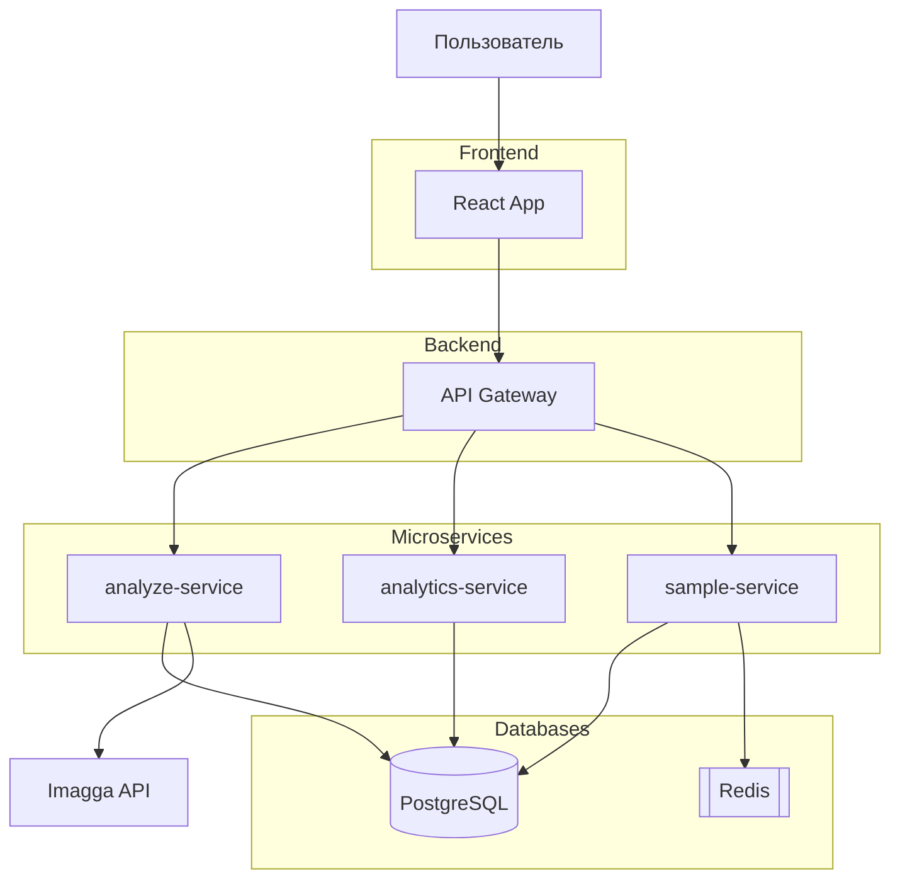

# Тарасов Кирилл | Python Backend Developer | 17 лет

*Создаю работающие приложения из идей. Полный цикл: от архитектуры до продукта, работающего на VPS*

```python
# Мой подход к разработке:
def build_project(idea: Concept) -> DeployedSystem:
    """
    От проектирования до production-деплоя.
    """
    architecture = design_architecture()  # SOLID, Clean Code, Микросервисы
    backend = implement_backend()         # Python, Django/FastAPI, PostgreSQL
    tests = optimize_and_test()           # Pytest, CI/CD, 85%+ coverage
    containers = containerize()           # Docker, Docker Compose
    production = deploy_to_production()   # VPS, Gunicorn, Nginx, SSL
    
    return system_live_on_server()        # nightcoder.rdeaps.com | imagetaganalyzer.rdeaps.com

```

**Основной стек:** `Python` `Django` `FastAPI` `PostgreSQL` `Docker` `K8S` `Nginx` `Gunicorn` `VPS`

[](https://t.me/bravekirty)
[](tel:+79096552008)  
[](mailto:bravekirty@gmail.com)
[](https://github.com/bravekirty)


## 🐱 Мои пет-проекты

<div align="center">

| 🧩 | Проект | Демо | Код | Технологии | Что внутри |
|-|--------|------|-----|------------|------------|
| 🌙 | [Форум **Night Coder**](https://nightcoder.rdeaps.com) | [👉 Демо](https://nightcoder.rdeaps.com) |  [GitHub](https://github.com/bravekirty/NightCoder) | `Django` `PostgreSQL` `Docker` `CI/CD` | **SOLID**, тесты 85%+, модули |
| 🖼️ | [**Image Tag Analyzer**](https://imagetaganalyzer.rdeaps.com) |  [👉 Демо](https://imagetaganalyzer.rdeaps.com) |  [GitHub](https://github.com/bravekirty/ImageTagAnalyzer) | `FastAPI` `K8s` `React` `Redis` | **Микросервисы**, async, AI анализ |

</div>

---

## 🌙 Night Coder Django форум


**🔗 [Демо](https://nightcoder.rdeaps.com) | [Код](https://github.com/bravekirty/NightCoder) | [SOLID реализация](https://github.com/bravekirty/NightCoder/blob/main/django_forum/core/SOLID.md)**

> Полнофункциональная платформа для сообщества разработчиков с системой репутации, развернутое на моём VPS.

### 🎯 Ключевые компетенции:

| Область | Что реализовано | Почему это важно |
|---------|----------------|------------------|
| **Архитектура** | [Все 5 принципов SOLID](https://github.com/bravekirty/NightCoder/blob/main/django_forum/core/SOLID.md) в системе голосования | Умение проектировать масштабируемые системы |
| **Production** | Развернуто на моём VPS (Nginx, Gunicorn, SSL) | Полный контроль над инфраструктурой |
| **Качество кода** | 85%+ тестов, CI/CD, чистая история коммитов | Профессиональный подход к разработке |
| **Завершённые модули** | Аутентификация, Форум, Отзывы, Лидерборды | Способность доводить до production |

### 🏗️ **Технические особенности:**

```yaml
Архитектура:
  - Монолит с чистыми слоями
  - Система голосования: Repository + Service pattern
  - Модульная структура: разделение на apps (forum, reviews, users, votes)

База данных:
  - PostgreSQL 17 с оптимизированными индексами
  - Оптимизированные запросы через ORM

DevOps:
  - Docker + Docker Compose
  - CI: тесты и линтинг
  - VPS: Gunicorn, Nginx, SSL

Фронтенд:
  - Bootstrap 5 + кастомный CSS
  - Темная тема, адаптивный дизайн
  - JavaScript для интерактива
```

### 📈 **Цифры и факты:**

- ✅ **85%+ покрытие тестами** ключевой бизнес-логики
- ✅ **80+ коммитов** с осмысленными сообщениями
- ✅ **5+ месяцев** работы без критических багов в production
- ✅ **Полный production стек:** Django + PostgreSQL + Docker + Gunicorn + Nginx
- ✅ **SOLID-архитектура** с документацией и примерами
- ✅ **CI/CD пайплайн:** тесты + линтинг при каждом коммите

### 📚 **Что я вынес из проекта:**

1. **SOLID это как детальки LEGO:**
    - Каждая "деталька" (класс) делает одну вещь
    - Все детальки соединяются стандартным образом
    - Можно собрать что угодно из одних и тех же деталек
    - Гораздо проще поддерживать, тестировать и добавлять новый функционал
2. **Разобрался в production:** настроить проект на VPS проще, чем кажется
3. **Довести до конца > сделать много:** 5 завершённых модулей ценнее 10 незаконченных
4. **Современные инструменты:** DeepSeek помогает с рутиной (тесты, фронтенд), освобождая время для архитектурных решений


---



